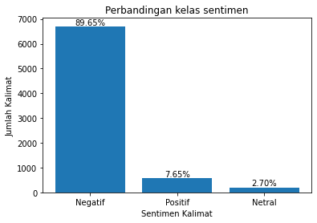
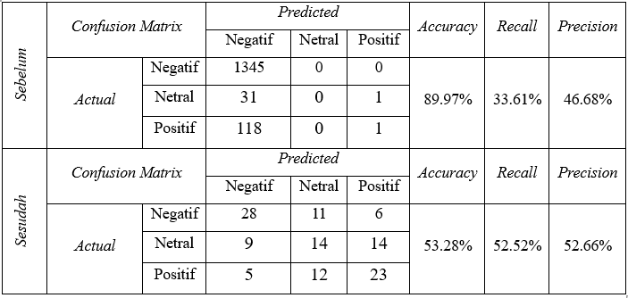

# Analisis Sentimen Pengguna Twitter Terhadap Topik Perpajakan Di Indonesia Menggunakan Tf-Idf Dan Naive Bayes
Adapun tujuan dari penelitian ini ialah sebagai berikut :
1. Mengukur tingkat sentimen masyarakat pengguna twitter terhadap topik perpajakan pasca serangkaian peristiwa yang secara signifikan menurunkan kepercayaan masyarakat terhadap instansi perpajakan.
2. Mendeskripsikan evaluasi penggunaan metode pembobotan TF-IDF dan Klasifikasi Naive Bayes dalam melakukan analisis sentimen topik perpajakan.

Berdasarkan hasil pelabelan, terdapat 572 tweet dengan sentimen positif, 6706 tweet dengan sentimen negatif, dan 202 tweet dengan sentimen netral. Adapun perbandingan jumlah ketiga kelas sentimen tersebut seperti ditunjukkan oleh grafik berikut

Proses evaluasi model dilakukan terhadap dua skenario pengujian, yaitu klasifikasi pada data sebelum random under sampling dan setelah mengalami random sampling. Kedua skenario tersebut digunakan untuk menganalisis dan membandingkan performa model dalam mengklasifikasikan data pada kondisi yang berbeda. Hasil perbandingan dari kedua skenario tersebut seperti pada tabel berikut ini.

